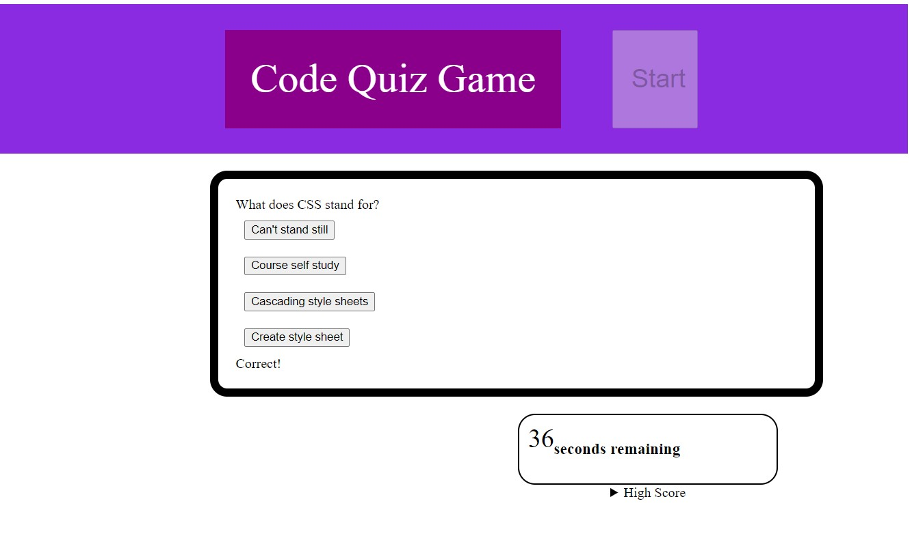

# Code-Quiz

Hi! This is my attempt at making a code-quiz through javascript. You can find it at:
https://fchang1720.github.io/Code-Quiz/

These are the steps that I went through to create it:

1) Established my index.html
    -created sections to display my questions and timer.
2) Created and linked my CSS file.
    -I added some simple styling to various html
    elements.
3) Created and linked my javascript file. 
    -Chose variables to store and display game content.
    -Created a timer and set its stop properties.
    -Added event listeners to various buttons.
    -Determined win, lose, and penalty conditions.
    -Created functions to store and retrieve information from local storage.
4) 

